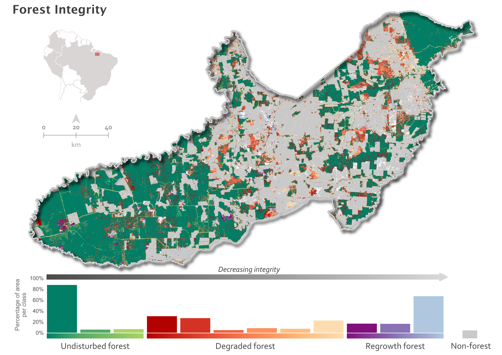
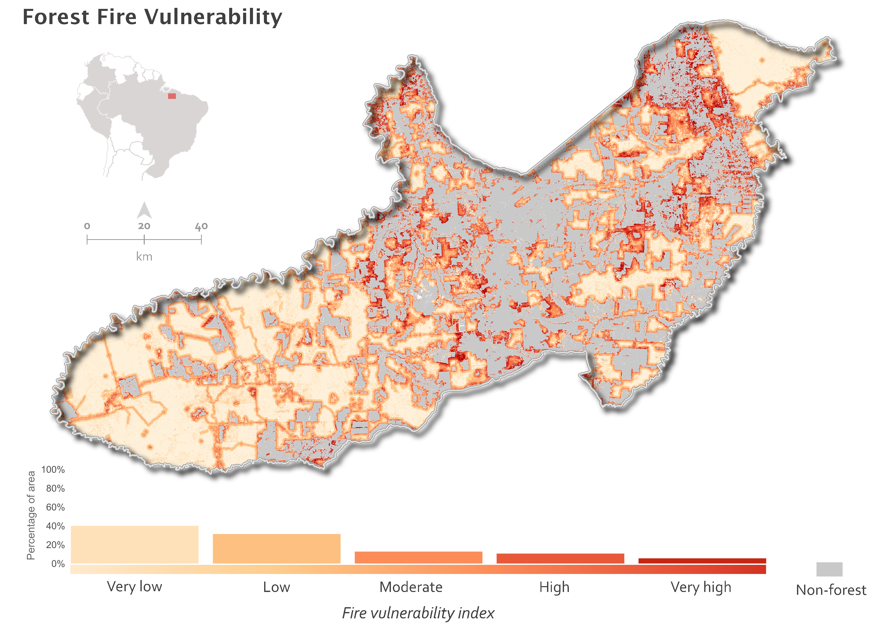
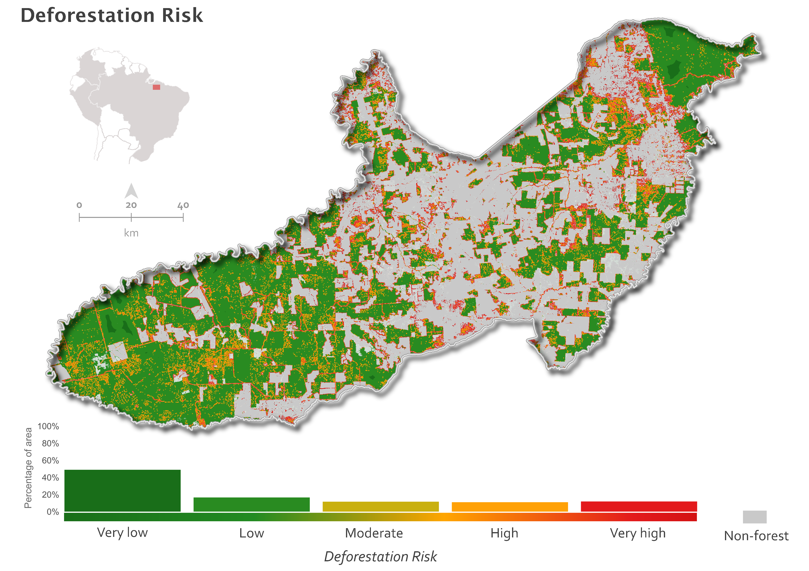
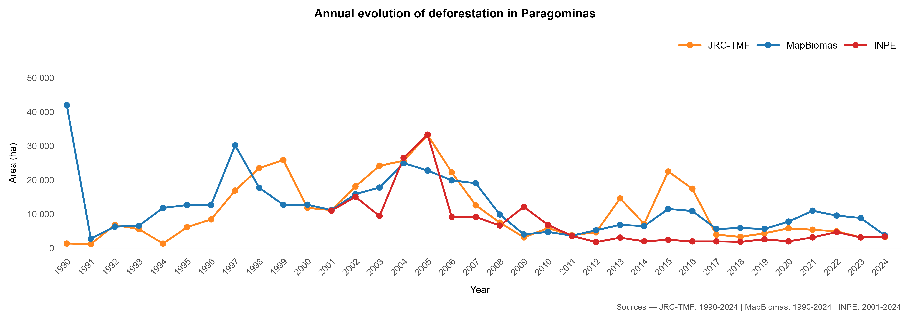
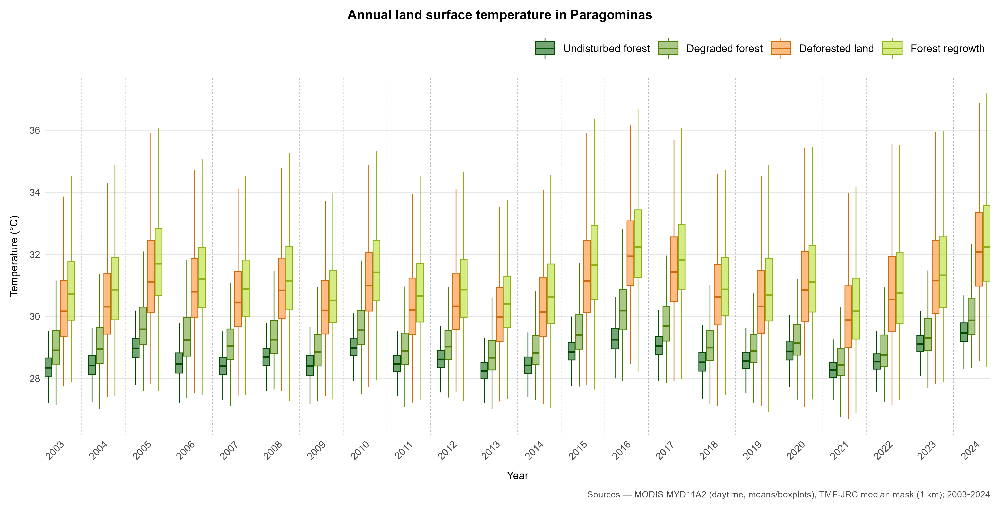
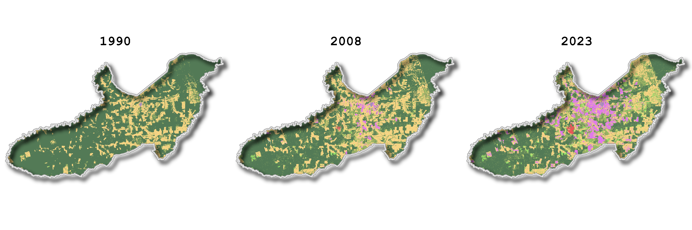

# TerrAmaz - Forest and Territorial Indicators

Geospatial workflows for producing forest monitoring and territorial planning indicators across four Amazonian territories, developed in the context of the [TerrAmaz](https://www.terramaz.org/) project at CIRAD.

**Lucas Lima** - Geomatics and remote sensing specialist  
[](https://linkedin.com/in/caslumali)
[](https://lucaslima.fr)


<p align="center">
  
</p>

---

## Overview

This repository documents geospatial workflows developed during a consultancy at CIRAD (2025) for the [TerrAmaz](https://www.terramaz.org/) project, funded by the French Development Agency (AFD).

The work focused on producing consistent forest and territorial indicators for four Amazonian territories:

- **Paragominas** (Pará, Brazil)
- **Cotriguaçu** (Mato Grosso, Brazil)
- **Guaviare** (Colombia)
- **Madre de Dios** (Peru)

The objective was to produce operational indicators for territorial diagnosis and planning across multiple territories, data sources, and languages, combining surface, structure, function, and ecosystem-service dimensions of forest change.

---

## Workflow scope

The published code covers:

- Google Earth Engine workflows for indicator inputs and large-scale extraction
- Python pipelines for raster processing, reprojection, mosaics, tiling, and Morphological Spatial Pattern Analysis (MSPA) preparation
- PyQGIS automation for GIS processing and map preparation
- R workflows for indicator charts, histogram summaries, transition diagrams, and multilingual outputs

---

## What this repository contains

| Folder | Content |
|---|---|
| `scripts/gee/` | Google Earth Engine scripts for deforestation, degradation, regrowth, climate, forest integrity, fire vulnerability, and transitions |
| `scripts/python/` | Python raster-processing workflows: mosaics, reprojection, MSPA preparation, tiling, and final assembly |
| `scripts/pyqgis/` | PyQGIS automation for raster processing and map preparation |
| `scripts/r/indicators/` | R scripts for charts and indicator outputs across territories and languages |
| `scripts/r/maps_histograms/` | R scripts for histogram-based summaries of forest integrity, fire vulnerability, and deforestation risk |
| `scripts/r/archetypes/` | R scripts related to territorial archetype clustering |
| `images/` | Final public showcase outputs used in this README |

---

## Indicators produced

The full workflow produced 10 main indicator families:

1. **Deforestation** - annual evolution from multiple sources
2. **Degradation** - forest degradation trends
3. **Regrowth** - secondary forest flow, stock, and age structure
4. **Burned area** - fire dynamics in forest and non-forest
5. **Temperature** - annual and monthly trends
6. **Precipitation** - annual and monthly patterns
7. **Land cover transitions** - temporal summaries of land-cover change
8. **Forest integrity** - composite spatial index
9. **Fire vulnerability** - spatial vulnerability mapping
10. **Deforestation risk** - predictive spatial risk outputs

These indicators were generated for each territory and, depending on the output type, in up to four languages.

---

## Workflow logic

The project combines several layers of work:

- satellite data extraction and preprocessing
- harmonization of multiple datasets and temporal references
- derived metrics and indicator tables
- chart production for reporting
- map production for territorial interpretation
- final communication outputs in several languages

In practical terms, the workflow brings together:

- **GEE** for large-scale Earth observation inputs
- **Python** for raster engineering and MSPA-related preprocessing
- **PyQGIS** for GIS automation and cartographic preparation
- **R** for analytical outputs, charts, and communication products

---

## Data sources and methodological references

Key data sources and references used across the workflow include:

- **JRC Tropical Moist Forest (TMF)** for forest-change and annual forest-mask inputs
- **MapBiomas** for land-cover information
- **MapBiomas Fire**, **GLAD Fire**, and **MODIS Burned Area** for burned-area inputs depending on territory
- **INPE/PRODES** for official deforestation information in Brazil
- **Deforisk** for deforestation-risk modelling in QGIS
- **MSPA (Morphological Spatial Pattern Analysis)** via GuidosToolbox for landscape-structure analysis

---

## Sample outputs

The public repo does not expose the full `results/` tree. Instead, it shows a compact subset of outputs for **Paragominas** as a representative showcase of a workflow that was produced for four territories.

The README highlights six indicator dimensions:

1. landscape structure
2. fire-related vulnerability
3. deforestation risk
4. observed deforestation dynamics
5. land-cover-linked temperature dynamics
6. land-cover transitions

Land-cover transitions are shown through two complementary visuals: a temporal comparison map and a Sankey summary.

### Key maps

| | |
|:---:|:---:|
|  |  |
| Forest integrity composite index | Fire vulnerability |

<p align="center">
  
</p>

<p align="center">
  Deforestation risk surface produced with the Deforisk plugin in QGIS.
</p>

### Indicator charts

| | |
|:---:|:---:|
|  |  |
| Deforestation trends from multiple sources | Annual temperature trends linked to land-cover dynamics |

### Land cover transitions



Temporal comparison of land cover in 1990, 2008, and 2023.


Sankey summary of land-cover transitions in Paragominas.

---

## Repository structure

```text
terramaz/
|-- scripts/
|   |-- gee/                 # GEE indicator extraction and preprocessing
|   |-- python/              # Raster-processing workflows and MSPA steps
|   |-- pyqgis/              # GIS automation
|   `-- r/
|       |-- indicators/      # Indicator charts
|       |-- maps_histograms/ # Histogram outputs
|       `-- archetypes/      # Territorial clustering
|-- images/                  # Final public showcase set
`-- README.md
```

---

## Acknowledgments

This work was carried out at [CIRAD - UR Forests and Societies](https://ur-forets-societes.cirad.fr/) within the [TerrAmaz](https://www.terramaz.org/) project, funded by the French Development Agency (AFD).
